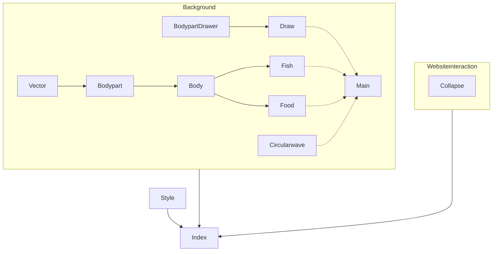

# Fish Animation Website

This is a simple website that features an animated fish swimming in the background.
The fish can be fed by clicking on the background.
To get a better view, the foreground can be collapsed by clicking the button in the bottom right corner.
It can be viewed at https://stefanscode.github.io/Website.

## Project Structure

## Development
The project uses vanilla JavaScript with no external dependencies. Each file has a specific responsibility:
- `vector.js`:      Handles vector calculations
- `bodypart.js`:    Handles individual body parts
- `body.js`:        Controls the fish body structure
- `fish.js`:        Implements fish behavior
- `food.js`:        Implements food behavior
- `circularwave.js`:A wave when tossing food   
- `draw.js`:        Handles rendering
- `main.js`:        Main application logic
-`collaps.js`:      Handles collapsing foreground